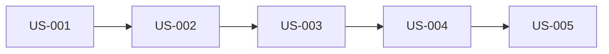

# rorca-ensure-postgres — Diagrams

Generated: 2026-03-12T18:17:44.811Z

## storyDeps

### Mermaid

```mermaid
graph LR
  US-001["US-001"]
  US-002["US-002"]
  US-003["US-003"]
  US-004["US-004"]
  US-005["US-005"]
  US-001 --> US-002
  US-002 --> US-003
  US-003 --> US-004
  US-004 --> US-005
```

### ASCII
```
US-001
  └─ US-002
    └─ US-003
      └─ US-004
        └─ US-005
```
