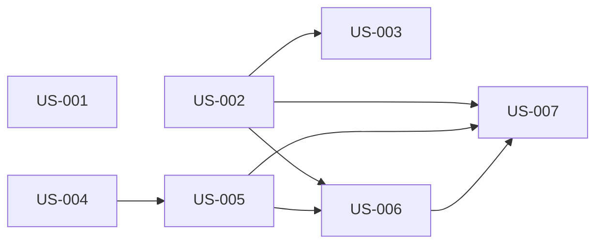

# rorca-memory-consolidation — Diagrams

Generated: 2026-03-18T01:08:38.854Z

## storyDeps

### Mermaid

```mermaid
graph LR
  US-001["US-001"]
  US-002["US-002"]
  US-003["US-003"]
  US-004["US-004"]
  US-005["US-005"]
  US-006["US-006"]
  US-007["US-007"]
  US-002 --> US-003
  US-004 --> US-005
  US-002 --> US-006
  US-005 --> US-006
  US-002 --> US-007
  US-005 --> US-007
  US-006 --> US-007
```

### ASCII
```
US-001
US-002
  └─ US-003
  └─ US-006
    └─ US-007
US-004
  └─ US-005
```
