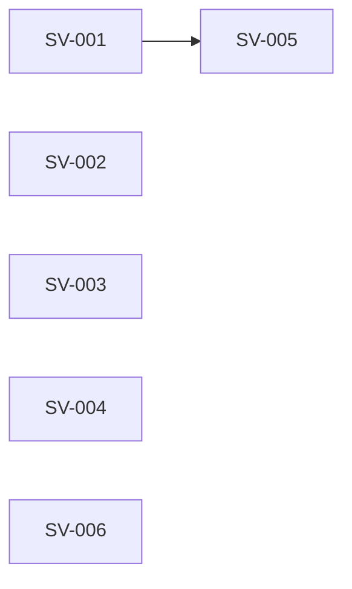

# rorca-spec-validator — Diagrams

Generated: 2026-03-12T05:43:40.610Z

## storyDeps

### Mermaid

```mermaid
graph LR
  SV-001["SV-001"]
  SV-002["SV-002"]
  SV-003["SV-003"]
  SV-004["SV-004"]
  SV-005["SV-005"]
  SV-006["SV-006"]
  SV-001 --> SV-005
```

### ASCII
```
SV-001
  └─ SV-005
SV-002
SV-003
SV-004
SV-006
```
