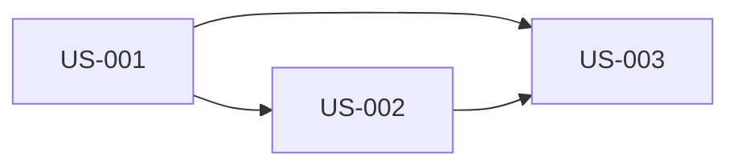

# rorca-story-model-assignment — Diagrams

Generated: 2026-03-12T23:16:39.536Z

## storyDeps

### Mermaid

```mermaid
graph LR
  US-001["US-001"]
  US-002["US-002"]
  US-003["US-003"]
  US-001 --> US-002
  US-001 --> US-003
  US-002 --> US-003
```

### ASCII
```
US-001
  └─ US-002
    └─ US-003
```
